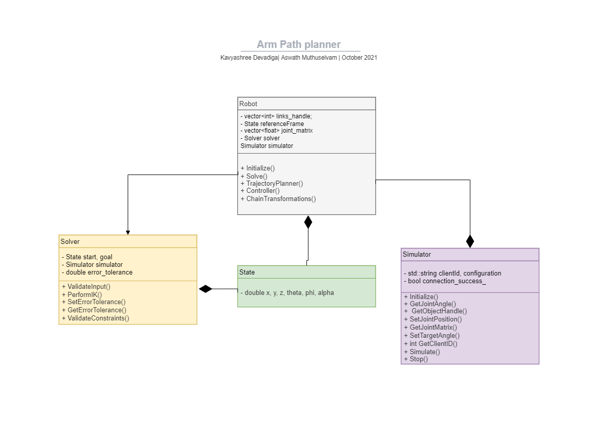

[](https://app.travis-ci.com/kavyadevd/AcmeRoboticsPathPlanner)
[](https://coveralls.io/github/kavyadevd/AcmeRoboticsPathPlanner?branch=main) [](https://opensource.org/licenses/MIT)
<div align="center">
   <h1 align="center">Arm path planner</h1>
   <h3 align="center">
      A manipulator path planner with IK solver for Acme Robotics
   </h3>
</div>
</hr>
</hr>
<div align="center">
   <h4>Overview</h4>
</div>
This is a project for the path planning of a robotic arm manipulator. The work was proposed and developed for Acme Robotics. The system will provide a solution for a 6DOF UR5 robotic arm path planning consisting of an IK solver and path planner and the output will be simulated in a virtual environment.
The input to the system will be the desired goal cartesian coordinates. This input will be applied to a 6 DOF robotic arm with set initial points and known configuration. Based on this data, the IK solver will calculate the configuration of individual arm components. To avoid unforeseen problems, each calculation will be validated against the arm constraints.
For the implementation of the IK solver and path planner, we are using Pseudo Inverse of Jacobian method to control the end effector by feeding very small joint angles. The trajectory is generated based on a linear path from start to end position.
The development team of two will work together and use agile methodologies. A standard software pair programming will be implemented. 
The driver-navigator method will ensure code is inspected on the go and this collaboration will result in a bug-free, robust product.
</br>

## Project Development Documentation
The project backlog for AIP process can be found  [here](https://docs.google.com/spreadsheets/d/1zX0pAVmc6K0hxXXXkboeQGreZijge_ZQpGS1sxYqzik/edit?usp=sharing)
Team discussions can be found [here](https://docs.google.com/document/d/1RdvYMPEdTKRoNJPfLJrx5js1_1oWBHXO7ZER36gTqio/edit?usp=sharing)

## 

<span align="centre"></img> [source](https://www.researchgate.net/profile/Alexandre-Campeau-Lecours/publication/329975514/figure/fig3/AS:710940106452992@1546512738050/UR5-robot-from-Universal-robot-with-the-definition-of-the-the-reference-frame-x-0-y-0.png)</span>
## Authors
<div style="display:grid;grid-template-columns:auto auto">
<div>
   <p> <b>1. Kavyashree Devadiga (117398045)</b> </br>Computer buff, interested in smart autonomous systems. Has a Bachelors degree in Computer Science and is currently pursuing Masters of Engineering in Robotics at University of Maryland College Park.
      <a href="https://www.linkedin.com/in/kavyashree-devadiga/" title="LinkedIn" rel="nofollow noreferrer">
      
      </a> &nbsp; 
      <a href="https://github.com/kavyadevd" rel="nofollow noreferrer" title="Github">
      
      </a>
   </p>
</div>
<div>
   <p> <b>2. Aswath Muthuselvam (118286204)</b></br>Holds interest in Autonomous Mobile Agents, Computer Vision, Simultaneous Localization and Mapping, AI, Real-Time systems, and controls. Has a Bachelors's degree in Electrical, Electronics, and Communications Engineering and is currently pursuing Masters of Engineering in Robotics at the University of Maryland College Park.
      <a href="https://www.linkedin.com/in/aswath-m/" title="LinkedIn" rel="nofollow noreferrer">
      
      </a> &nbsp; 
      <a href="https://github.com/aswathselvam" title="Github" rel="nofollow noreferrer">
      
      </a>
   </p>
   </div
</div>


## Installation

The project requires a C++ environment, coppeliasim application for execution.

```bash
git clone --recursive https://github.com/kavyadevd/AcmeRoboticsPathPlanner.git
cd AcmeRoboticsPathPlanner
mkdir -p build
cd build
cmake ..
make
```

Fet Eigen for matrix computations
```bash
git clone https://gitlab.com/libeigen/eigen.git
```

MoveIt

For complete MoveIt installation refer to official documentation [here](https://ros-planning.github.io/moveit_tutorials/doc/getting_started/getting_started.html).
On Ubuntu 18.04 and above MoveIt can be installed using following commands:
    
   ```bash
   mkdir -p ~/ws_moveit/src
   cd ~/ws_moveit/src

   wstool init .
   wstool merge -t . https://raw.githubusercontent.com/ros-planning/moveit/master/moveit.rosinstall
   wstool update -t .
  ```
 
 Coppeliasim
  [Download Coppeliasim](https://www.coppeliarobotics.com/files/CoppeliaSim_Player_V4_2_0_Ubuntu20_04.tar.xz) unpack the compressed file.
  Run the simulator script by running the following command on cmd:
  ```bash
  $<CoppeliaSim>/coppeliaSim.sh <AcmeRoboticsPathPlanner>/ur5_CoppeliaSim_scene.ttt
  ```
The Matlab file used for calculation of Transformation matrices and Jacobian of UR5 robot arm can be found [here](https://drive.google.com/file/d/1btgJoJhWMMR9vwU3pwflIu2xZPp-fAr0/view)

**Example Demo:**
Below GIF shows end-effector reaching the goal state using Pseudo Inverse Jacobian method.
 

**Assumptions:**
1. Singularity is dealt with randomly perturbing the robot arm joints by a small angle so that the Inverse Jacobian is found in the next iteration of Inverse Kinematics calculation.
2. Joint angle limits are not applied with respect to the physical model. 
3. The arm's width is not considered, this might lead to angle commands that cause self-collision near the arm joints.

**Our UML diagram**
 

## Building for code coverage

```bash
sudo apt-get install lcov
cmake -D COVERAGE=ON -D CMAKE_BUILD_TYPE=Debug ../
make
make code_coverage
```


## Plugins


- CppCheckEclipse

    To install and run cppcheck in Eclipse

    1. In Eclipse, go to Window -> Preferences -> C/C++ -> cppcheclipse.
    Set cppcheck binary path to "/usr/bin/cppcheck".

    2. To run CPPCheck on a project, right-click on the project name in the Project Explorer 
    and choose cppcheck -> Run cppcheck.
    
    3. To run on terminal
    ```bash
    cppcheck --enable=all --std=c++11 -I include/ --suppress=missingIncludeSystem $( find . -name *.cpp -or -name *.h | grep -vE -e "^./build/" -e "^./vendor/") >     Results/cppcheckoutput.xml
    ```
    Results are present at Results/cppcheckoutput.xml
    
- Cpplint
   1. To run cpplint on terminal
   ```bash
   cpplint $( find . -name *.cpp | grep -vE -e "^./build/" -e "^./vendor/") $( find . -name *.hpp | grep -vE -e "^./build/" -e "^./vendor/") >                    Results/cpplintoutput.txt
   ```
   Results are present at Results/cpplintoutput.xml

- Google C++ Style

    To include and use Google C++ Style formatter in Eclipse

    1. In Eclipse, go to Window -> Preferences -> C/C++ -> Code Style -> Formatter. 
    Import [eclipse-cpp-google-style][reference-id-for-eclipse-cpp-google-style] and apply.

    2. To use Google C++ style formatter, right-click on the source code or folder in 
    Project Explorer and choose Source -> Format

[reference-id-for-eclipse-cpp-google-style]: https://raw.githubusercontent.com/google/styleguide/gh-pages/eclipse-cpp-google-style.xml

- Git

    It is possible to manage version control through Eclipse and the git plugin, but it typically requires creating another project. If you're interested in this, try it out yourself and contact me on Canvas.

- Doxygen

    The HTML page for project outlines can be generated using the following commands

    1.  doxygen -g
    2.  doxygen Doxyfile

## Licensing
The project is licensed under [MIT License](https://opensource.org/licenses/MIT). Click [here](https://github.com/kavyadevd/AcmeRoboticsPathPlanner/blob/main/LICENSE) to know more


